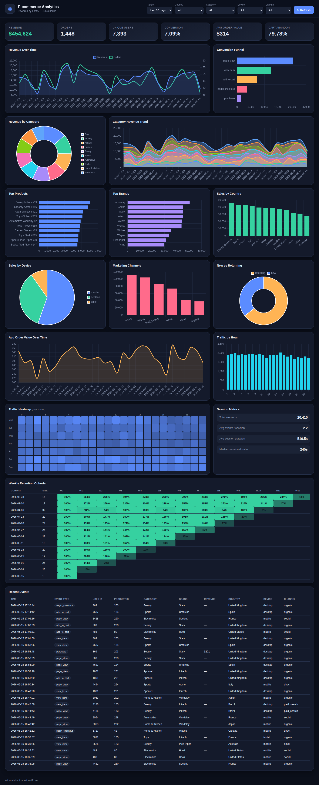
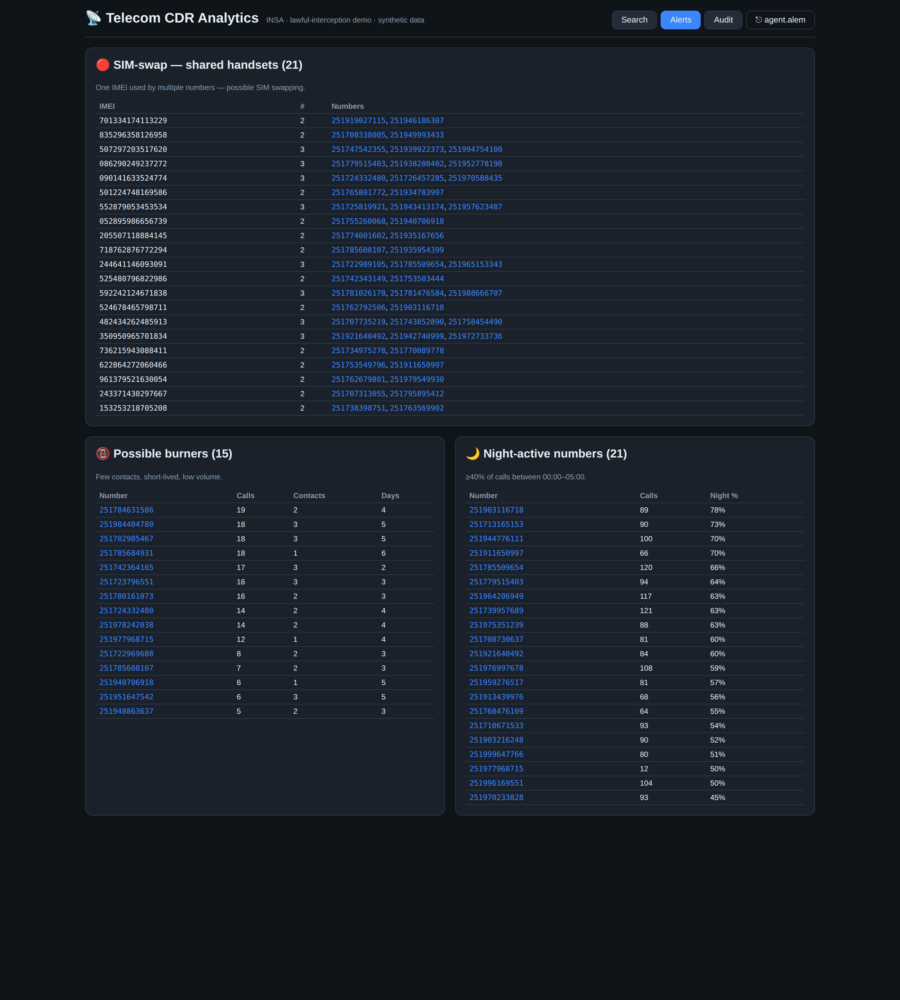
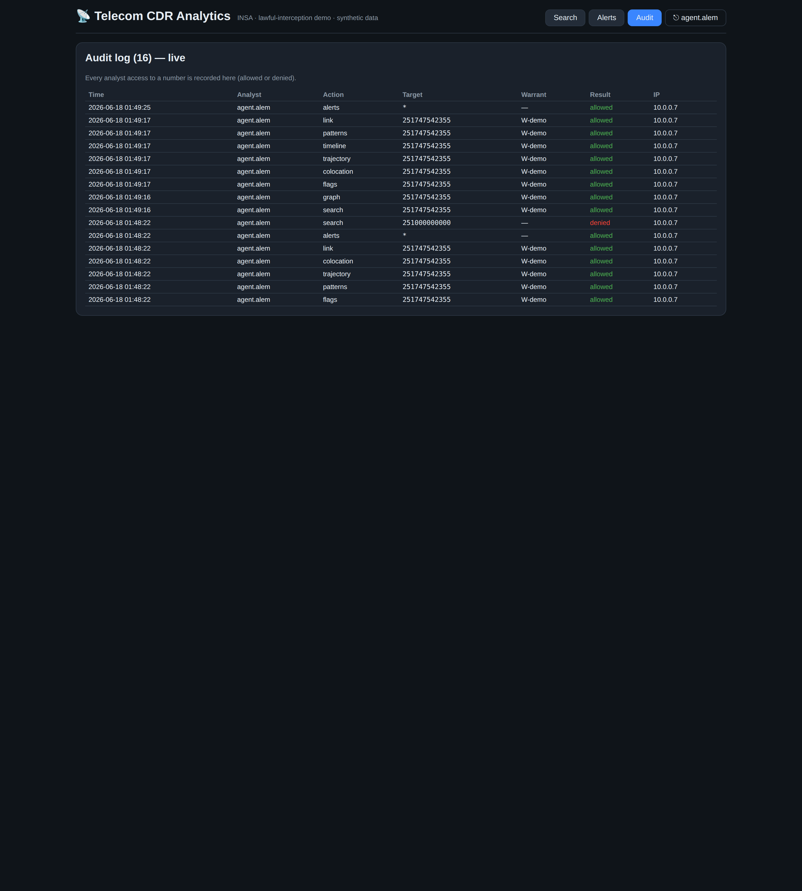

# Telecom CDR Analytics Platform

A polyglot, docker-compose monorepo demo of a **lawful-interception CDR (Call
Detail Record) analytics tool** — built as an INSA Ethiopia internal demo.

> ⚠️ **Demo / educational build.** All data is **synthetic** (generated with
> Faker). Court/warrant authorization is **out of scope** for this build and
> will be added later as an auth layer — the code leaves clean seams for it (a
> pass-through auth middleware stub on every API route, and an unused
> `warrant_id` column on the CDR table).



_Subscriber investigation view: profile + stats, call-location map, risk flags,
pattern-of-life heatmap, contact network (force graph), shared-device /
co-located detection, movement trajectory, link analysis, co-location-in-time,
and the virtualized call timeline._

| Dataset-wide alerts | Audit log (live) |
|---|---|
|  |  |

_Left: SIM-swap / burner / night-active detection across the whole dataset.
Right: every analyst access recorded (note the **denied** entry — a number with
no active warrant). Map base tiles are blank in these captures because OSM tiles
are network-blocked in the build sandbox; markers render and tiles load in a
real deployment._

## Architecture

One synthetic ingest stream fans out to two stores; a Go API reads both (with a
Redis cache) and serves a React analyst dashboard.

```
                 ┌─────────────────────────────────────────────┐
  ingest (Py) ──▶│  ClickHouse   raw CDRs + rollups (counts,    │
   Faker, dual   │               minutes, map points)           │
   write         │  Memgraph     contact graph (shared devices, │
                 │               co-located towers)             │
                 └───────────────┬───────────────┬─────────────┘
                                 │               │
                        ┌────────▼───────────────▼────────┐
   React (Vite +  ◀────▶│  Go (Fiber) REST API + Redis cache│
   TanStack Query)      │  /search /graph /timeline         │
                        └───────────────────────────────────┘
```

| Component   | Tech | Role |
|-------------|------|------|
| `clickhouse/` | ClickHouse | raw 26-col CDR table + pre-aggregated rollups + callee projection |
| `ingest/`     | Python (Faker) | synthetic CDR generator, dual-write to ClickHouse + Memgraph |
| `api/`        | Go (Fiber) + Redis | REST API over both stores, parameterized queries, auth stub |
| `web/`        | React + Vite + TanStack Query | analyst dashboard (profile, Leaflet map, force-graph, timeline) |

## Status

Built incrementally; each layer verified before the next.

- [x] **ClickHouse schema + rollups** (`clickhouse/schema.sql`) — verified
- [x] **Ingest** — synthetic generator, dual-write (`ingest/`) — verified
- [x] **Go Fiber API** — search/graph/timeline + analytics, Redis cache (`api/`) — verified
- [x] **React dashboard** — profile, map, force-graph, timeline + analytics tabs (`web/`) — builds
- [x] **docker-compose wiring** + run instructions
- [x] **Analytics** — link analysis, co-location-in-time, suspicious-pattern detection, pattern-of-life, movement trajectory
- [x] **Auth layer** — analyst login (JWT), warrant enforcement, audit log

### API endpoints

| Endpoint | Description |
|----------|-------------|
| `POST /auth/login` | analyst login → JWT (`{username, password}`) |
| `GET /me` | current analyst identity |
| `GET /search/:number` | profile + call count + total minutes + map points |
| `GET /graph/:number?depth=1\|2` | contact network (force-graph) + shared devices + co-located towers |
| `GET /timeline/:number?page=&page_size=&from=&to=` | paginated call records with date-range filter |
| `GET /flags/:number` | risk flags: shared device / SIM-swap, burner, late-night, mostly-outgoing |
| `GET /patterns/:number` | day×hour call heatmap + inferred home/work towers |
| `GET /trajectory/:number?from=&to=&limit=` | tower connections in time order (movement playback) |
| `GET /colocation/:number?window=<min>` | others at the same tower within ±window minutes |
| `GET /link/:a/:b` | direct calls, common contacts, shared towers, shortest path between two numbers |
| `GET /alerts` | dataset-wide SIM-swap / burner / night-active detection |
| `GET /audit` | recent analyst access log |
| `GET /health` | health check (public) |

All queries are **parameterized** (`?` bindings for ClickHouse, `$param` for
Cypher). A short-TTL Redis cache fronts read results.

### Auth, warrants & audit (lawful-interception controls)

Auth is **enforced** (set `AUTH_ENABLED=false` to bypass for local dev):

- **Login** with an analyst credential → JWT (sent as `Authorization: Bearer`).
  Demo accounts: `agent.alem` / `insa-demo`, `supervisor.bekele` / `insa-demo`.
- Every access to a specific number requires an **active warrant** covering it
  (`telecom.warrants`); otherwise the API returns **403**. By default the ingest
  job seeds a warrant for **every subscriber in the dataset**, so any real number
  opens; a number that isn't in the data (e.g. a typo) is denied — and the denial
  is recorded in the audit log, demonstrating the control. (Warrant seeding runs
  on every ingest start and repairs itself even if CDRs were already present.)
- Every access (allowed **or** denied) is written to the **audit log**
  (`telecom.audit_log`) and shown live in the dashboard's *Audit* tab.

```bash
TOKEN=$(curl -s localhost:8080/auth/login -H 'content-type: application/json' \
  -d '{"username":"agent.alem","password":"insa-demo"}' | jq -r .token)
curl -s localhost:8080/search/<number> -H "Authorization: Bearer $TOKEN"
```

## Quick start

```bash
docker compose up --build
```

This starts ClickHouse, Memgraph, Redis, the Go API, and the React dashboard,
then runs the **ingest** job once to generate ~500k synthetic CDRs across ~2000
subscribers and dual-write them to ClickHouse + Memgraph. First run takes a few
minutes (image pulls + seeding).

| Service | URL |
|---------|-----|
| Dashboard | http://localhost:3000 |
| API | http://localhost:8080 |
| ClickHouse (HTTP) | http://localhost:8123 |
| Memgraph (Bolt) | bolt://localhost:7687 |

### What number do I search?

Every subscriber in the dataset is warranted by default, so any real number
opens (a non-existent number returns 403). The empty search screen lists
**clickable sample numbers**, and the **Alerts** tab numbers are clickable too.

The generator also prints a handful of **interesting sample numbers** at the end
of seeding — copy one into the dashboard search bar:

```bash
docker compose logs ingest | grep -A12 "SAMPLE NUMBERS"
```

You'll get well-connected subscribers (rich contact graphs) and a shared-device
pair (both numbers share one IMEI — good for the shared-device panel).

### Example API calls

```bash
# Profile + call count + total minutes + map points
curl "http://localhost:8080/search/<number>"

# Contact network (depth 1-2) + shared devices + co-located towers
curl "http://localhost:8080/graph/<number>?depth=2"

# Paginated timeline with a date-range filter
curl "http://localhost:8080/timeline/<number>?page=1&page_size=50&from=2026-04-01&to=2026-06-18"
```

### Ad-hoc queries

```bash
# ClickHouse — busiest towers
docker compose exec clickhouse clickhouse-client -q \
  "SELECT location_name, sum(hits) h FROM telecom.cdr_location_rollup GROUP BY location_name ORDER BY h DESC"

# Memgraph — shared-device detection (see ingest/graph_queries.cypher for more)
echo "MATCH (a:Subscriber)-[:USED]->(d:Device)<-[:USED]-(b:Subscriber)
      WHERE a.number < b.number
      RETURN d.imei, collect(a.number)+collect(b.number) LIMIT 10;" \
  | docker compose exec -T memgraph mgconsole
```

### Reseeding

The ingest job is idempotent — it skips if CDRs already exist. To wipe and
regenerate, set `FORCE_RESEED=true` for the `ingest` service (or
`docker compose down -v` to drop the ClickHouse volume) and bring it back up.

## Data model

See `clickhouse/schema.sql` (CDR table, rollups, callee projection — documented
inline) and `ingest/graph_queries.cypher` (graph model + shared-device and
co-located-tower detection).

## Auth seam (out of scope, stubbed)

Warrant/court authorization is intentionally **not** implemented. Two clean
seams are left so it slots in later without reshaping anything:

- `api/middleware.go` — a pass-through `authMiddleware` on every route; warrant
  checks go here.
- `clickhouse/schema.sql` — an unused `warrant_id String DEFAULT ''` column on
  the CDR table for later filtering.
